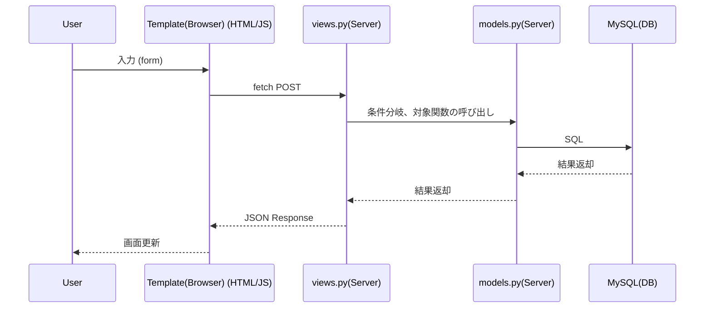
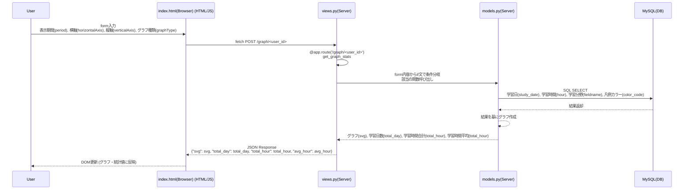

# アプリ名
VSLog(Visualized Study Log：視覚化された学習記録)

## 概要
日々の学習記録をグラフ化して「見える化」させるアプリである。  
学習状況の把握、学習へのモチベーション維持・向上を目的とする。

## 背景
未経験からITエンジニアになるためには、1000時間以上の勉強時間が必要とされている中、自身の学習時間がどの程度なのか、どのような分野を学習してきたのか等、学習状況が把握しづらいと感じていた。  
日々の学習記録を日報形式で記録し、蓄積した学習履歴を視覚化できるアプリがあれば、自身の学習状況が容易に把握でき、モチベーションの維持・向上にも繋がると考えた。  
さらに、未経験からITエンジニアへ転職する際に、本アプリを通じて企業へ学習状況を公開することで、学習意欲・スキルをアピールできるとともに、IT企業の採用担当者においても、自社が求める人材にマッチしているか否かの判断材料の一助になり得ると考えた。  
よって、日々の学習記録をグラフ化して「見える化」させるアプリを開発することとした。

## ターゲット
本アプリはユーザーが学習する分野を自由に設定できるため、IT関連の従事者に限らず、小中高生・学生もターゲットに含めるものとした。
- 小中高生・学生
- 社会人
- 就職・転職希望者
- IT企業の採用担当者

## 使用技術
主な使用技術は以下のとおりである。

### インフラ
- Docker
- (AWS)※今後デプロイのため使用する予定

### フロントエンド
- HTML
- CSS
- JavaScript

### バックエンド
- Python
- MySQL

### フレームワーク・ライブラリ
- Flask
- Flask-Migrate
- Flask-SQLAlchemy
- Jinja2
- matplotlib

## デモ
以下のデモ動画にて、アプリの内容を示す。

## アプリの起動・終了方法
本アプリはDockerにて開発環境の構築を行っているため、はじめに、自身のローカルPCにDockerデスクトップをインストールする。  
https://www.docker.com/ja-jp/

Dockerデスクトップをインストール後、GitHubから本アプリをcloneする。その後、ターミナル上で以下のコマンドを打つと本アプリがローカルホストで起動する。  
起動コマンド：`docker compose up --build`

次にブラウザを開き、URLの入力フォームに以下を入力する。  
http://localhost:5000/login

本アプリ（Flask）のポート番号は「5000」に設定しており、その後ろにログイン画面のURLを記述している。  
既にローカルPC上でポート番号「5000」が使用されている場合は、.envファイルのFlaskポートの番号を変更する。例）5001, 55000など  

（以下が該当箇所であり、必要に応じて修正する。）
***  
ファイルパス：2025.07_personal_development/.env  
該当箇所：`FLASK_PORT=5000`  
***

アプリを終了するには、ターミナル上で以下のコマンドを打つ。  
終了コマンド：`docker compose down`

## ディレクトリ・ファイル構成
ディレクトリ・ファイル構成を以下に示す。  
本アプリでは「MVTモデル」を採用しており、M（Model）が「models.py」ファイル、V（View）が「views.py」ファイル、T（Template）が「templates」ディレクトリに当たる。

<pre>
.
└── 2025.07_personal_development/               # 個人開発プロジェクトのルート
    ├── Docker/                                 # FlaskとMySQL用のDocker設定
    │   ├── Flask/                              # Flask用ディレクトリ
    │   │   └── Dockerfile                      # FlaskのDockerfile
    │   └── MySQL/                              # MySQL用ディレクトリ
    │       ├── Dockerfile                      # MySQLのDockerfile
    │       └── my.cnf                          # MySQL設定ファイル
    ├── migrations/                             # DBマイグレーション関連
    │   ├── versions                            # バージョン管理スクリプト
    │   ├── alembic.ini                         # Alembic設定ファイル
    │   ├── env.py                              # マイグレーション環境設定
    │   ├── README                              # マイグレーションテンプレREADME
    │   └── script.py.mako                      # マイグレーションスクリプトテンプレ
    ├── VSLog/                                  # Flaskアプリ本体
    │   ├── static/                             # 静的ファイル（CSS, JS, 画像）
    │   │   ├── css/                            # CSSディレクトリ
    │   │   │   ├── auth.css                    # 認証前（ログイン、新規登録、パスワード設定）のCSS
    │   │   │   ├── base.css                    # ヘッダー、メイン、フッターの共通CSS
    │   │   │   ├── color.css                   # 本アプリで使用する色設定のCSS
    │   │   │   ├── components.css              # ボタン、テーブル等の共通コンポーネント（部品）のCSS
    │   │   │   ├── index.css                   # ログイン後のホーム画面のCSS
    │   │   │   ├── reset.css                   # ブラウザのデフォルトCSSのリセットのためのCSS
    │   │   │   ├── responsive.css              # レスポンシブデザイン対応（タブレット・スマホ）のCSS
    │   │   │   └── study.css                   # 学習記録関連のCSS
    │   │   ├── image/                          # 画像ディレクトリ
    │   │   │   ├── favicon/                    # ファビコン画像のディレクトリ
    │   │   │   │   ├── apple-touch-icon.png    # あらゆるブラウザや端末で対応可能なように以下の画像を用意
    │   │   │   │   ├── favicon-96x96.png       
    │   │   │   │   ├── favicon.icon            
    │   │   │   │   ├── favicon.svg             
    │   │   │   │   └── site.webmanifest        
    │   │   │   ├── average.png                 # ホーム画面の平均時間を示す画像
    │   │   │   ├── days.png                    # ホーム画面の学習日数を示す画像
    │   │   │   ├── logo.png                    # ロゴ画像
    │   │   │   ├── menu-icon.png               # ハンバーガーメニューの画像
    │   │   │   └── total.png                   # ホーム画面の合計時間を示す画像
    │   │   └── js/                             # Javascriptディレクトリ
    │   │       ├── common.js                   # ハンバーガーメニュー、flashメッセージ等の共通動作の設定JS
    │   │       ├── index.js                    # ホーム画面の設定JS
    │   │       ├── study_fields.js             # 学習分野登録・編集画面の設定JS
    │   │       ├── study_logs_list.js          # 学習履歴一覧画面の設定JS
    │   │       └── study_logs.js               # 学習記録登録・編集画面の設定JS
    │   ├── templates/                          # Jinja2テンプレート (HTML)のディレクトリ（MVTのTに相当）
    │   │   ├── base.html                       # 各HTMLの基本機能（ヘッダー・フッター、共通動作等）のHTML
    │   │   ├── index.html                      # ホーム画面のHTML
    │   │   ├── login.html                      # ログイン画面のHTML
    │   │   ├── password_reset.html             # パスワード再設定画面（認証前）のHTML
    │   │   ├── password_update.htm             # パスワード変更画面（認証後）のHTML
    │   │   ├── profile_edit.html               # プロフィール編集画面のHTML
    │   │   ├── signup.html                     # 新規登録画面のHTML
    │   │   ├── study_fields.html               # 学習分野の登録・編集画面のHTML
    │   │   ├── study_logs_list.html            # 学習履歴一覧画面のHTML
    │   │   └── study_logs.html                 # 学習記録の登録・編集画面のHTML
    │   ├── __init__.py                         # VSLogディレクトリをパッケージとして認識させるための空ファイル
    │   ├── app.py                              # 本アプリを起動するためのファイル
    │   ├── models.py                           # DBモデル、グラフ作成・描画等のためのファイル（MVTのMに相当）
    │   └── views.py                            # 各画面へのルーティングのためのファイル（MVTのVに相当）
    ├── .dockerignore                           # Dockerビルド除外ファイル
    ├── .env                                    # 環境変数設定ファイル
    ├── .gitignore                              # Git管理対象外リスト
    ├── compose.yaml                            # FlaskとMySQLのDocker compose設定
    ├── entrypoint.sh                           # Flaskアプリ起動時スクリプト
    ├── README.md                               # 本プロジェクトの説明ファイル
    └── requirements.txt                        # Python依存パッケージ一覧
</pre>

### ディレクトリ・ファイル命名規則
Flaskアプリの中身である.pyファイルは、前述したMVTモデルに準じ、「models.py」, 「views.py」と命名した。  
Flaskでのtemplateファイル（html）は、Jinja2テンプレートエンジンが認識できるよう「templates」直下に置くこととし、各URL名と突き合わせができるよう、URL名と同じファイル名で命名した。  
base.htmlはすべてのhtmlファイルに共通するヘッダー、フッター等の設定内容を記述している。  
css, JSファイルは、htmlファイルとの突き合わせができるよう基本的にはhtmlと同じ名前にしているが、共通化できるものは一つのファイルに整理することとし、common, componentsという名前にした。

## 詳細説明
以降より、本アプリの詳細説明を示す。

### 使用技術の選定理由

### 機能一覧
本アプリはユーザーが学習分野を自由に登録し、その学習分野に関する学習時間・学習内容を日報形式で登録すると自動的にグラフが作成され、積み上げた学習記録が可視化できるようになっている。  
ホーム画面にて、学習日数・学習時間の合計・平均の統計値、グラフ（棒グラフ・円グラフ・折れ線グラフ）が表示される。  
統計値は表示期間によって、動的に変更される。例えば、月間2025年9月の表示形式を選択した場合、その年月の統計値が自動で取得できる。  
グラフは、横軸・縦軸・グラフ種類からユーザーが表示したいものを選択し、表示できる。  
プルダウンメニューの変更があれば、自動でフォームが送信され、統計値・グラフのいずれも非同期通信で内容が変化する。  
以下に機能一覧を示す。  

| **分類** | **URL** | **機能** |
| --- | --- | --- |
| 認証前 | /login | ログイン機能 |
|  | /signup | 新規登録機能 |
|  | /password-reset | パスワード再設定機能 |
| 認証後 | /logout | ログアウト機能 |
|  | /index/<user_id> | 学習日数・学習時間の合計・学習時間の平均の表示機能 |
|  | /index/<user_id> | 表示期間（今週・先週・月間・年間・全期間）選択機能 |
|  | /index/<user_id> | 横軸表示形式（年月日別・分野別）選択機能 |
|  | /index/<user_id> | 縦軸表示形式（時間・％）選択機能 |
|  | /index/<user_id> | グラフ種類の（棒グラフ・円グラフ・折れ線グラフ）選択機能 |
|  | /study-logs/<user_id> | 学習記録の登録・編集機能 |
|  | /study-logs/<user_id> | 年月日に応じた学習記録の切り替え機能 |
|  | /study-fields/<user_id> | 学習分野の登録・編集機能 |
|  | /study-logs/<user_id>
/study-fields/<user_id> | 新規入力項目追加機能 |
|  | /study-logs/<user_id>
/study-fields/<user_id> | 入力項目削除機能 |
|  | /study-logs-list/<user_id> | 学習履歴一覧の閲覧機能 |
|  | /study-logs-list/<user_id> | 学習履歴一覧のモーダルウインドウ表示機能 |
|  | /study-logs-list/<user_id> | 学習履歴一覧の入力・未入力の色分け機能（青・赤） |
|  | /study-logs-list/<user_id> | 年付きに応じた学習履歴一覧の切り替え機能 |
|  | /profile-edit/<user_id> | プロフィール編集機能 |
|  | /password-update/<user_id> | パスワード変更機能 |
| 共通 |  | レスポンシブデザイン機能 |
|  |  | flashメッセージ（正常・エラー）の色分け表示機能 |

### 画面設計、UI/UX
#### デザインの方向性
- シンプルで誰でも簡単に直感的に使える。
- 目が疲れない。奇抜さよりもシンプルさを重視する。
- グラフのカラーはユーザーが自由に選択できるようにする。グラフがカラフルになりやすいので、グラフ以外の要素は、できる限り白・黒・グレー等の無彩色に抑える。
- 画面遷移が少なく、必要な情報にすぐアクセスできる。
- 学習状況を文字情報だけではなく、数字・図で示せる。
- 学習日が一目でわかるように、学習履歴の記入・未記入を色分けする。

#### 使用する色

- ベースカラー：グレー、白
- メインカラー：青（信頼・誠実）
- 文字色：黒

#### 画面遷移図
画面遷移図を以下に示す。  

#### 画面デザイン（ワイヤーフレーム）
画面デザインを以下に示す。画面デザインはFigmaで作成した。  

### DB設計
#### ER図
ER図を以下に示す。  

#### ER図の考え方
- 学習記録テーブル（study_logs）はuser_idと紐づけることで、userが学習記録を「登録・編集・削除」できるようにする。
また、学習分野テーブル（fields）と紐づけることで、学習分野を削除するとその学習分野に関連する学習記録を削除できるようにする。
- 「年月日別」、「分野別」のグラフを作成するために、study_logsテーブルには学習日（study_date）、学習分野（field_id）を設定し、SQL操作でグラフ取得を行う。
- user_idはURLに表示されるため、第3者が推測できないよう、uuid(4)を使用する。そのため、VARCHAR文字数は、uuid(4)の文字数36文字とする。
- emailは重複が生じないように、UNIQUE設定とする。
- 学習日（study_date)の型は、日付で管理するため、時間を含まないDATEとする。
- 学習時間（hours）の型は、時分までの入力を考慮したDECIMALとし、小数点以下2桁表示までとする。また、数十年分の長期累計時間を表示する場合を考慮しDECIMAL(6,2)とする。最大：99999.99時間（およそ11年分の合計時間）まで表示可能である。
- 分野名（field_name）の文字数は、PC上での視認性確保のため、最大20文字のVARCHAR(20)とする。
- 凡例カラー（color_code）は、RGBで表現することとし、16進カラーコード（#FFFFFF）を表現可能なVARCHAR(7)とする。
- 2038年問題を考慮し、created_atの型は「DATETIME」とする。

### データフロー
本アプリにおけるデータフローを次のとおり示す。  
fetch APIにより、ユーザーが表示したい情報をFlaskへ送り、MySQL（DB）から必要な情報を取得し、responseを返すという流れである。  

#### 全体図
データフローの全体図を以下に示す。  

#### 詳細図
データフローの詳細図を以下に示す。  
ここでは、本アプリの核となる機能の「グラフ・統計値取得」を対象とする。
詳細図では、全体図にformの種類、Flask側での条件分岐、関数等を追記して示すものとする。  

